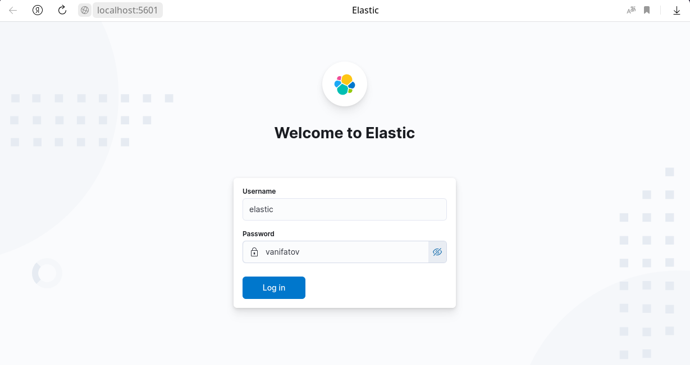
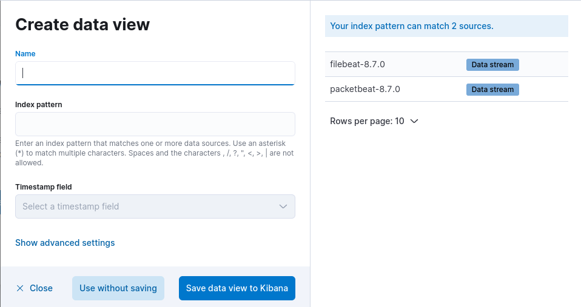
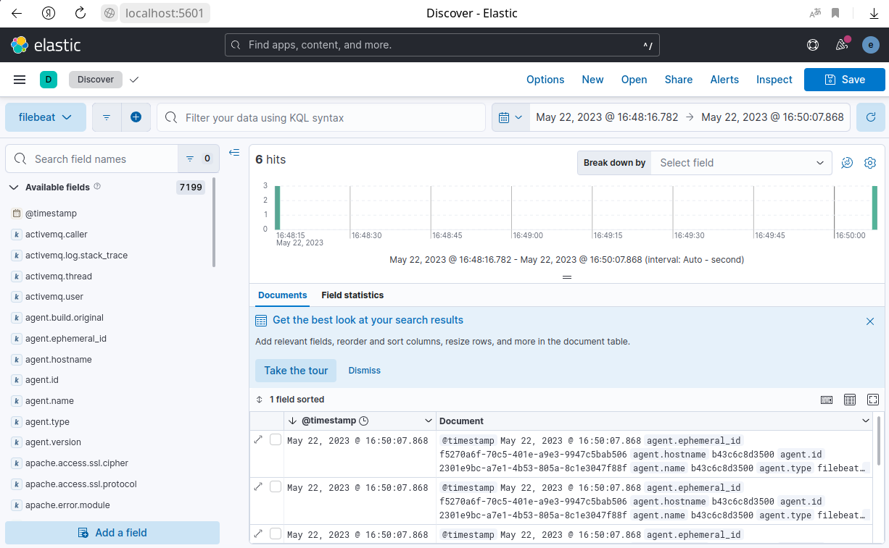

# Развертывание системы мониторинга ELK Stack (ElasticSearch)
Артём Ванифатов

## Цель работы

1.  Освоить базовые подходы централизованного сбора и накопления
    информации

2.  Освоить современные инструменты развертывания контейнирозованных
    приложений

3.  Закрепить знания о современных сетевых протоколах прикладного уровня

## Исходные данные

1.Ноутбук с Windows 11

2.Docker Desktop

3.WSL2 с ОС Ubuntu 20.04 LTS

## Задание

1.Развернуть систему мониторинга на базе Opensearch

-   ElasticSearch

-   Beats (Filebeat, Packetbeat)

-   Kibana

2.Настроить сбор информации о сетевом трафике

3.Настроить сбор информации из файлов журналов (лог-файлов)

4.Оформить отчет в соответствии с шаблоном

## Содержание ЛР

### Шаг 1

Docker - система “легкой виртуализации”, позволяющая запускать
приложения в изолированных контейнерах.

Docker позволяет загружать заранее подготовленные контейнеры
мейнтейнерами (разработчиками) прямо из Интернета (команда docker pull),
минуя длительные этапы предварительной настройки программного окружения
и программных зависимостей.

Для удобства развёртывания был использован docker-compose.

Для работы ElasticSearch требуется увеличить размер виртуальной памяти:

``` bash
sudo su -c 'echo vm.max_map_count=262144 >> /etc/sysctl.conf'
```

### Шаг 2

Следует подготовить файл с переменными окружения для конфигурации
развертываемых сервисов (файл .env):

    ELASTIC_PASSWORD -- пароль пользователя 'elastic'
    KIBANA_PASSWORD -- пароль пользоавтеля 'kibana_system'
    STACK_VERSION -- версия устанавливаемых образов ElasticSearch
    CLUSTER_NAME -- имя кластера
    LICENSE -- вид лицензии
    ES_PORT -- порт, который будет использоваться ElasticSearch
    KIBANA_PORT -- порт, который будет использоваться графической панелью управления Kibana
    MEM_LIMIT -- максимум используемой памяти (в байтах)

### Шаг 3

Был создан сервис для генерации TLS-сертификатов:

``` yml
  setup:
    image: elasticsearch:${STACK_VERSION}
    volumes:
      - certs:/usr/share/elasticsearch/config/certs
    user: "0"
    command: >
      bash -c '
        if [ x${ELASTIC_PASSWORD} == x ]; then
          echo "Set the ELASTIC_PASSWORD environment variable in the .env file";
          exit 1;
        elif [ x${KIBANA_PASSWORD} == x ]; then
          echo "Set the KIBANA_PASSWORD environment variable in the .env file";
          exit 1;
        fi;
        if [ ! -f config/certs/ca.zip ]; then
          echo "Creating CA";
          bin/elasticsearch-certutil ca --silent --pem -out config/certs/ca.zip;
          unzip config/certs/ca.zip -d config/certs;
        fi;
        if [ ! -f config/certs/certs.zip ]; then
          echo "Creating certs";
          echo -ne \
          "instances:\n"\
          "  - name: es\n"\
          "    dns:\n"\
          "      - es\n"\
          "      - localhost\n"\
          "    ip:\n"\
          "      - 127.0.0.1\n"\
          "  - name: filebeat\n"\
          "    dns:\n"\
          "      - es01\n"\
          "      - localhost\n"\
          "    ip:\n"\
          "      - 127.0.0.1\n"\
          "  - name: packetbeat\n"\
          "    dns:\n"\
          "      - es01\n"\
          "      - localhost\n"\
          "    ip:\n"\
          "      - 127.0.0.1\n"\
          > config/certs/instances.yml;
          > config/certs/instances.yml;
          bin/elasticsearch-certutil cert --silent --pem -out config/certs/certs.zip --in config/certs/instances.yml --ca-cert config/certs/ca/ca.crt --ca-key config/certs/ca/ca.key;
          unzip config/certs/certs.zip -d config/certs;
        fi;
        echo "Setting file permissions"
        chown -R root:root config/certs;
        find . -type d -exec chmod 750 \{\} \;;
        find . -type f -exec chmod 640 \{\} \;;
        echo "Waiting for Elasticsearch availability";
        until curl -s --cacert config/certs/ca/ca.crt https://es:9200 | grep -q "missing authentication credentials"; do sleep 30; done;
        echo "Setting kibana_system password";
        until curl -s -X POST --cacert config/certs/ca/ca.crt -u "elastic:${ELASTIC_PASSWORD}" -H "Content-Type: application/json" https://es:9200/_security/user/kibana_system/_password -d "{\"password\":\"${KIBANA_PASSWORD}\"}" | grep -q "^{}"; do sleep 10; done;
        echo "All done!";
      '
    healthcheck:
      test: ["CMD-SHELL", "[ -f config/certs/es/es.crt ]"]
      interval: 1s
      timeout: 5s
      retries: 120
```

### Шаг 4

Был создан сервис для узла ElasticSearch и графической панели управления
Kibana

``` yml
  es:
    depends_on:
      setup:
        condition: service_healthy
    image: elasticsearch:${STACK_VERSION}
    volumes:
      - certs:/usr/share/elasticsearch/config/certs
      - esdata:/usr/share/elasticsearch/data
    ports:
      - ${ES_PORT}:9200
    environment:
      - node.name=es
      - cluster.name=${CLUSTER_NAME}
      - cluster.initial_master_nodes=es
      - ELASTIC_PASSWORD=${ELASTIC_PASSWORD}
      - bootstrap.memory_lock=true
      - xpack.security.enabled=true
      - xpack.security.http.ssl.enabled=true
      - xpack.security.http.ssl.key=certs/es/es.key
      - xpack.security.http.ssl.certificate=certs/es/es.crt
      - xpack.security.http.ssl.certificate_authorities=certs/ca/ca.crt
      - xpack.security.transport.ssl.enabled=true
      - xpack.security.transport.ssl.key=certs/es/es.key
      - xpack.security.transport.ssl.certificate=certs/es/es.crt
      - xpack.security.transport.ssl.certificate_authorities=certs/ca/ca.crt
      - xpack.security.transport.ssl.verification_mode=certificate
      - xpack.license.self_generated.type=${LICENSE}
    mem_limit: ${MEM_LIMIT}
    ulimits:
      memlock:
        soft: -1
        hard: -1
    healthcheck:
      test:
        [
          "CMD-SHELL",
          "curl -s --cacert config/certs/ca/ca.crt https://localhost:9200 | grep -q 'missing authentication credentials'",
        ]
      interval: 10s
      timeout: 10s
      retries: 120

 kibana:
    depends_on:
      es:
        condition: service_healthy
    image: elastic/kibana:${STACK_VERSION}
    volumes:
      - certs:/usr/share/kibana/config/certs
      - kibanadata:/usr/share/kibana/data
    ports:
      - ${KIBANA_PORT}:5601
    environment:
      - SERVERNAME=kibana
      - ELASTICSEARCH_HOSTS=https://es:9200
      - ELASTICSEARCH_USERNAME=kibana_system
      - ELASTICSEARCH_PASSWORD=${KIBANA_PASSWORD}
      - ELASTICSEARCH_SSL_CERTIFICATEAUTHORITIES=config/certs/ca/ca.crt
    mem_limit: ${MEM_LIMIT}
    healthcheck:
      test:
        [
          "CMD-SHELL",
          "curl -s -I http://localhost:5601 | grep -q 'HTTP/1.1 302 Found'",
        ]
      interval: 10s
      timeout: 10s
      retries: 120
```

### Шаг 5

Следующим шагом является установка и настройка средств сбора информации.

Сервис Filebeat:

``` yml
  filebeat:
    depends_on:
      es:
        condition: service_healthy
    image: elastic/filebeat:${STACK_VERSION}
    container_name: filebeat
    volumes:
    - ./filebeat.yml:/usr/share/filebeat/filebeat.yml
    - ./logs/:/var/log/app_logs/
    - certs:/usr/share/elasticsearch/config/certs
    environment:
    - ELASTICSEARCH_HOSTS=https://es:9200
    - ELASTICSEARCH_USERNAME=elastic
    - ELASTICSEARCH_PASSWORD=${ELASTIC_PASSWORD}
    - ELASTICSEARCH_SSL_CERTIFICATEAUTHORITIES=config/certs/ca/ca.crt
```

Содержимое файла конфигурации filebeat.yml:

``` yml
filebeat.inputs:
- type: filestream
  id: sys-logs
  enabled: true
  paths:
    - /var/log/app_logs/*

output.elasticsearch:
  hosts: '${ELASTICSEARCH_HOSTS:elasticsearch:9200}'
  username: '${ELASTICSEARCH_USERNAME:}'
  password: '${ELASTICSEARCH_PASSWORD:}'
  ssl:
    certificate_authorities: "/usr/share/elasticsearch/config/certs/ca/ca.crt"
    certificate: "/usr/share/elasticsearch/config/certs/filebeat/filebeat.crt"
    key: "/usr/share/elasticsearch/config/certs/filebeat/filebeat.key"
```

Сервис Packetbeat:

``` yml
  packetbeat:
    depends_on:
      es:
        condition: service_healthy
    image: elastic/packetbeat:${STACK_VERSION}
    container_name: packetbeat
    user: root
    cap_add: ['NET_RAW', 'NET_ADMIN']
    volumes:
    - ./packetbeat.yml:/usr/share/packetbeat/packetbeat.yml
    - certs:/usr/share/elasticsearch/config/certs
    - /var/run/docker.sock:/var/run/docker.sock
    environment:
    - ELASTICSEARCH_HOSTS=https://es:9200
    - ELASTICSEARCH_USERNAME=elastic
    - ELASTICSEARCH_PASSWORD=${ELASTIC_PASSWORD}
    - ELASTICSEARCH_SSL_CERTIFICATEAUTHORITIES=config/certs/ca/ca.crt
```

Сервису packetbeat требуется повышение привелегий для получения доступа
к сети контейнеров, за что отвечает параметр cap_add. Также необходимо
прописать доступ к сокету Docker – таким образом сбор сетевой трафика
будет проводиться по всем контейнерам.

Файл конфигурации:

``` yml
packetbeat.interfaces.device: any

packetbeat.flows:
  timeout: 30s
  period: 10s

packetbeat.protocols.dns:
  ports: [53]
  include_authorities: true
  include_additionals: true

packetbeat.protocols.http:
  ports: [80, 5601, 9200, 8080, 8081, 5000, 8002]

packetbeat.protocols.memcache:
  ports: [11211]

packetbeat.protocols.mysql:
  ports: [3306]

packetbeat.protocols.pgsql:
  ports: [5432]

packetbeat.protocols.redis:
  ports: [6379]

packetbeat.protocols.thrift:
  ports: [9090]

packetbeat.protocols.mongodb:
  ports: [27017]

packetbeat.protocols.cassandra:
  ports: [9042]

processors:
- add_cloud_metadata: ~

output.elasticsearch:
  hosts: '${ELASTICSEARCH_HOSTS:elasticsearch:9200}'
  username: '${ELASTICSEARCH_USERNAME:}'
  password: '${ELASTICSEARCH_PASSWORD:}'
  ssl:
    certificate_authorities: "/usr/share/elasticsearch/config/certs/ca/ca.crt"
    certificate: "/usr/share/elasticsearch/config/certs/packetbeat/packetbeat.crt"
    key: "/usr/share/elasticsearch/config/certs/packetbeat/packetbeat.key"
```

### Шаг 6

Запуск сервисов:

``` bash
docker-compose up -d
```

    Creating network "prak3_default" with the default driver
    Creating prak3_setup_1 ... 
    Creating prak3_setup_1 ... done
    Creating prak3_es_1    ... 
    Creating prak3_es_1    ... done
    Creating packetbeat    ... 
    Creating prak3_kibana_1 ... 
    Creating filebeat       ... 
    Creating packetbeat     ... done
    Creating prak3_kibana_1 ... done
    Creating filebeat       ... done

Проверка работоспособности сервисов:

``` bash
docker ps
```

    CONTAINER ID   IMAGE                      COMMAND                  CREATED          STATUS                                     PORTS                                                 NAMES
    b43c6c8d3500   elastic/filebeat:8.7.0     "/usr/bin/tini -- /u…"   1 second ago     Up Less than a second                                                                            filebeat
    a91b047bcf58   elastic/kibana:8.7.0       "/bin/tini -- /usr/l…"   1 second ago     Up Less than a second (health: starting)   0.0.0.0:5601->5601/tcp, :::5601->5601/tcp             prak3_kibana_1
    8d7c470db68d   elastic/packetbeat:8.7.0   "/usr/bin/tini -- /u…"   1 second ago     Up Less than a second                                                                            packetbeat
    f2dd0d04ae7e   elasticsearch:8.7.0        "/bin/tini -- /usr/l…"   22 seconds ago   Up 21 seconds (healthy)                    0.0.0.0:9200->9200/tcp, :::9200->9200/tcp, 9300/tcp   prak3_es_1
    11094131367b   elasticsearch:8.7.0        "/bin/tini -- /usr/l…"   23 seconds ago   Up 23 seconds (healthy)                    9200/tcp, 9300/tcp                                    prak3_setup_1

### Шаг 7

Поле ввода логина в Kibana:



Проверка работоспособности систем сбора информации:


Filebeat и Packetbeat были успешно запущены и подключены к
Elasticsearch.

### Шаг 8

Теперь нужно создать средства для просмотра данных:



Панель просмотра для Filebeat:



Панель просмотра для Packetbeat:


## Оценка результата

Была успешно развёрнута система мониторинга на базе Elasticsearch.

Был настроен сбор информации из файлов журналов.

Был настроен сбор информации о сетевом трафике.

## Вывод

В результате выполнения лабораторной работы были освоены базовые подходы
централизованного сбора и накопления информации, современные инструменты
развертывания контейнирозованных приложений и закреплены знания о
современных сетевых протоколах прикладного уровня.
