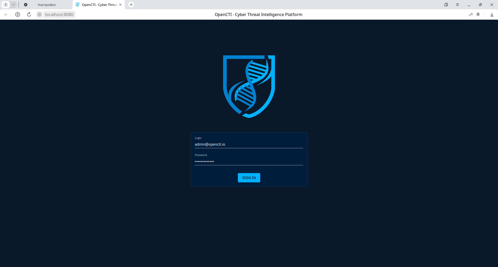
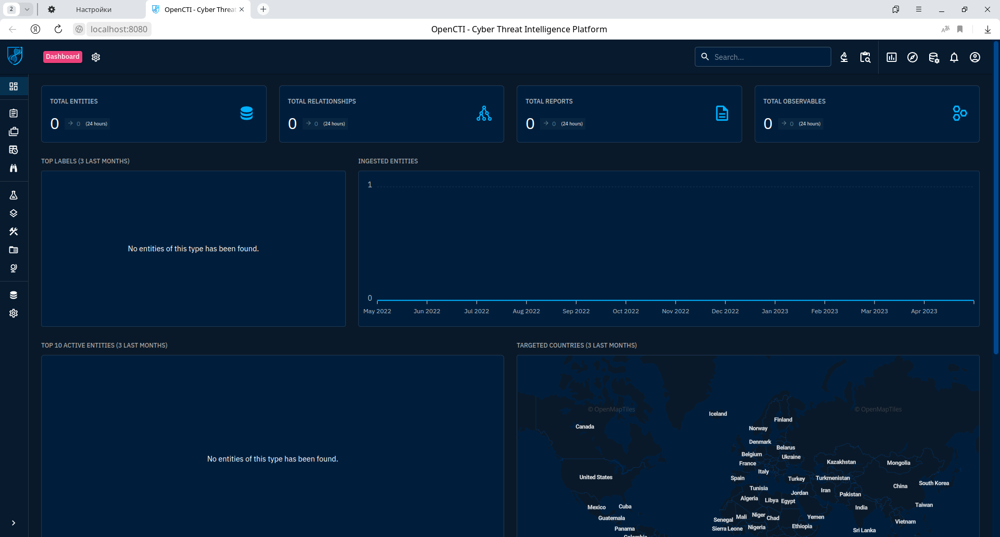
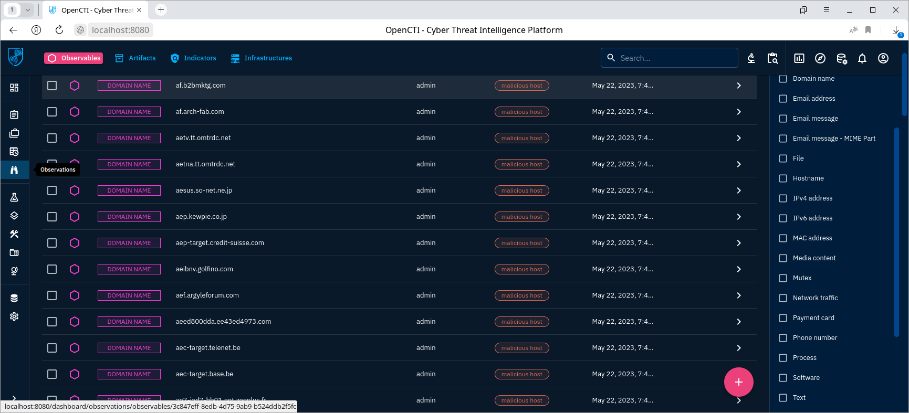
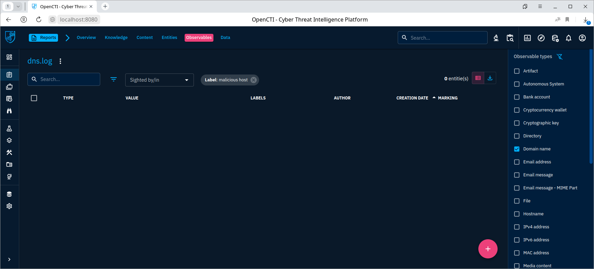

# Развертывание Threat intelligence Platform OpenCTI
Артём Ванифатов

## Цель работы

1.  Освоить базовые подходы процессов Threat Intelligence

2.  Освоить современные инструменты развертывания контейнеризованных
    приложений

3.  Получить навыки поиска информации об угрозах ИБ

## Исходные данные

1.Ноутбук с Windows 11

2.Docker Desktop

3.WSL2 с ОС Ubuntu 20.04 LTS

## Содержание ЛР

### Шаг 1

Был создан файл окружения .env со следующими параметрами:

    OPENCTI_ADMIN_EMAIL - логин администратора
    OPENCTI_ADMIN_PASSWORD - пароль администратора
    OPENCTI_ADMIN_TOKEN - токен администратора (UUID4) для API OpenCTI
    OPENCTI_BASE_URL - доменное имя OpenCTI
    MINIO_ROOT_USER - логин от minio
    MINIO_ROOT_PASSWORD - пароль от minio
    RABBITMQ_DEFAULT_USER - логин от rabbitmq
    RABBITMQ_DEFAULT_PASS - пароль от rabbitmq
    SMTP_HOSTNAME - хостнейм SMTP
    ELASTIC_MEMORY_SIZE - размер памяти, используемый Elasticsearch
    CONNECTOR_EXPORT_FILE_STIX_ID - уникальный идентификатор экспортируемого файла STIX
    CONNECTOR_EXPORT_FILE_CSV_ID - уникальный идентификатор экспортируемой CSV-таблицы
    CONNECTOR_EXPORT_FILE_TXT_ID - уникальный идентификатор экспортируемого txt-файла
    CONNECTOR_IMPORT_FILE_STIX_ID - уникальный идентификатор испортируемого файла STIX
    CONNECTOR_IMPORT_DOCUMENT_ID - уникальный идентификатор импортируемого файла

### Шаг 2

Для работоспособности OpenCTI необходимы следующие сервисы:

-   Redis:

``` yml
redis:
    image: redis:7.0.9
    restart: unless-stopped
    volumes:
      - redisdata:/data
```

-   Elasticsearch:

``` yml
elasticsearch:
    image: elastic/elasticsearch:8.6.2
    volumes:
      - esdata:/usr/share/elasticsearch/data
    environment:
      # Comment out the line below for single-node
      - discovery.type=single-node
      # Uncomment line below below for a cluster of multiple nodes
      # - cluster.name=docker-cluster
      - xpack.ml.enabled=false
      - xpack.security.enabled=false
      - "ES_JAVA_OPTS=-Xms${ELASTIC_MEMORY_SIZE} -Xmx${ELASTIC_MEMORY_SIZE}"
    restart: unless-stopped
    ulimits:
      memlock:
        soft: -1
        hard: -1
      nofile:
        soft: 65536
        hard: 65536
```

-   Minio:

``` yml
minio:
image: minio/minio:RELEASE.2023-02-27T18-10-45Z
volumes:
    - s3data:/data
ports:
    - "9000:9000"
environment:
    MINIO_ROOT_USER: ${MINIO_ROOT_USER}
    MINIO_ROOT_PASSWORD: ${MINIO_ROOT_PASSWORD}    
command: server /data
healthcheck:
    test: ["CMD", "curl", "-f", "http://localhost:9000/minio/health/live"]
    interval: 30s
    timeout: 20s
    retries: 3
restart: unless-stopped
```

-   RabbitMQ:

``` yml
rabbitmq:
image: rabbitmq:3.11-management
environment:
    - RABBITMQ_DEFAULT_USER=${RABBITMQ_DEFAULT_USER}
    - RABBITMQ_DEFAULT_PASS=${RABBITMQ_DEFAULT_PASS}
volumes:
    - amqpdata:/var/lib/rabbitmq
restart: unless-stopped
```

-   OpenCTI и OpenCTI worker:

``` yml
opencti:
image: opencti/platform:5.7.2
environment:
    - NODE_OPTIONS=--max-old-space-size=8096
    - APP__PORT=8080
    - APP__BASE_URL=${OPENCTI_BASE_URL}
    - APP__ADMIN__EMAIL=${OPENCTI_ADMIN_EMAIL}
    - APP__ADMIN__PASSWORD=${OPENCTI_ADMIN_PASSWORD}
    - APP__ADMIN__TOKEN=${OPENCTI_ADMIN_TOKEN}
    - APP__APP_LOGS__LOGS_LEVEL=error
    - REDIS__HOSTNAME=redis
    - REDIS__PORT=6379
    - ELASTICSEARCH__URL=http://elasticsearch:9200
    - MINIO__ENDPOINT=minio
    - MINIO__PORT=9000
    - MINIO__USE_SSL=false
    - MINIO__ACCESS_KEY=${MINIO_ROOT_USER}
    - MINIO__SECRET_KEY=${MINIO_ROOT_PASSWORD}
    - RABBITMQ__HOSTNAME=rabbitmq
    - RABBITMQ__PORT=5672
    - RABBITMQ__PORT_MANAGEMENT=15672
    - RABBITMQ__MANAGEMENT_SSL=false
    - RABBITMQ__USERNAME=${RABBITMQ_DEFAULT_USER}
    - RABBITMQ__PASSWORD=${RABBITMQ_DEFAULT_PASS}
    - SMTP__HOSTNAME=${SMTP_HOSTNAME}
    - SMTP__PORT=25
    - PROVIDERS__LOCAL__STRATEGY=LocalStrategy
ports:
- "8080:8080"
depends_on:
    - redis
    - elasticsearch
    - minio
    - rabbitmq
restart: unless-stopped
worker:
image: opencti/worker:5.7.2
environment:
    - OPENCTI_URL=http://opencti:8080
    - OPENCTI_TOKEN=${OPENCTI_ADMIN_TOKEN}
    - WORKER_LOG_LEVEL=info
depends_on:
    - opencti
deploy:
    mode: replicated
    replicas: 3
restart: unless-stopped
connector-export-file-stix:
image: opencti/connector-export-file-stix:5.7.2
environment:
    - OPENCTI_URL=http://opencti:8080
    - OPENCTI_TOKEN=${OPENCTI_ADMIN_TOKEN}
    - CONNECTOR_ID=${CONNECTOR_EXPORT_FILE_STIX_ID} # Valid UUIDv4
    - CONNECTOR_TYPE=INTERNAL_EXPORT_FILE
    - CONNECTOR_NAME=ExportFileStix2
    - CONNECTOR_SCOPE=application/json
    - CONNECTOR_CONFIDENCE_LEVEL=15 # From 0 (Unknown) to 100 (Fully trusted)
    - CONNECTOR_LOG_LEVEL=info
restart: unless-stopped
depends_on:
    - opencti
```

-   Коннекторы для работы с документами:

``` yml
connector-export-file-stix:
image: opencti/connector-export-file-stix:5.7.2
environment:
    - OPENCTI_URL=http://opencti:8080
    - OPENCTI_TOKEN=${OPENCTI_ADMIN_TOKEN}
    - CONNECTOR_ID=${CONNECTOR_EXPORT_FILE_STIX_ID} # Valid UUIDv4
    - CONNECTOR_TYPE=INTERNAL_EXPORT_FILE
    - CONNECTOR_NAME=ExportFileStix2
    - CONNECTOR_SCOPE=application/json
    - CONNECTOR_CONFIDENCE_LEVEL=15 # From 0 (Unknown) to 100 (Fully trusted)
    - CONNECTOR_LOG_LEVEL=info
restart: unless-stopped
depends_on:
    - opencti
connector-export-file-csv:
image: opencti/connector-export-file-csv:5.7.2
environment:
    - OPENCTI_URL=http://opencti:8080
    - OPENCTI_TOKEN=${OPENCTI_ADMIN_TOKEN}
    - CONNECTOR_ID=${CONNECTOR_EXPORT_FILE_CSV_ID} # Valid UUIDv4
    - CONNECTOR_TYPE=INTERNAL_EXPORT_FILE
    - CONNECTOR_NAME=ExportFileCsv
    - CONNECTOR_SCOPE=text/csv
    - CONNECTOR_CONFIDENCE_LEVEL=15 # From 0 (Unknown) to 100 (Fully trusted)
    - CONNECTOR_LOG_LEVEL=info
restart: unless-stopped
depends_on:
    - opencti
connector-export-file-txt:
image: opencti/connector-export-file-txt:5.7.2
environment:
    - OPENCTI_URL=http://opencti:8080
    - OPENCTI_TOKEN=${OPENCTI_ADMIN_TOKEN}
    - CONNECTOR_ID=${CONNECTOR_EXPORT_FILE_TXT_ID} # Valid UUIDv4
    - CONNECTOR_TYPE=INTERNAL_EXPORT_FILE
    - CONNECTOR_NAME=ExportFileTxt
    - CONNECTOR_SCOPE=text/plain
    - CONNECTOR_CONFIDENCE_LEVEL=15 # From 0 (Unknown) to 100 (Fully trusted)
    - CONNECTOR_LOG_LEVEL=info
restart: unless-stopped
depends_on:
    - opencti
connector-import-file-stix:
image: opencti/connector-import-file-stix:5.7.2
environment:
    - OPENCTI_URL=http://opencti:8080
    - OPENCTI_TOKEN=${OPENCTI_ADMIN_TOKEN}
    - CONNECTOR_ID=${CONNECTOR_IMPORT_FILE_STIX_ID} # Valid UUIDv4
    - CONNECTOR_TYPE=INTERNAL_IMPORT_FILE
    - CONNECTOR_NAME=ImportFileStix
    - CONNECTOR_VALIDATE_BEFORE_IMPORT=true # Validate any bundle before import
    - CONNECTOR_SCOPE=application/json,text/xml
    - CONNECTOR_AUTO=true # Enable/disable auto-import of file
    - CONNECTOR_CONFIDENCE_LEVEL=15 # From 0 (Unknown) to 100 (Fully trusted)
    - CONNECTOR_LOG_LEVEL=info
restart: unless-stopped
depends_on:
    - opencti
connector-import-document:
image: opencti/connector-import-document:5.7.2
environment:
    - OPENCTI_URL=http://opencti:8080
    - OPENCTI_TOKEN=${OPENCTI_ADMIN_TOKEN}
    - CONNECTOR_ID=${CONNECTOR_IMPORT_DOCUMENT_ID} # Valid UUIDv4
    - CONNECTOR_TYPE=INTERNAL_IMPORT_FILE
    - CONNECTOR_NAME=ImportDocument
    - CONNECTOR_VALIDATE_BEFORE_IMPORT=true # Validate any bundle before import
    - CONNECTOR_SCOPE=application/pdf,text/plain,text/html
    - CONNECTOR_AUTO=true # Enable/disable auto-import of file
    - CONNECTOR_ONLY_CONTEXTUAL=false # Only extract data related to an entity (a report, a threat actor, etc.)
    - CONNECTOR_CONFIDENCE_LEVEL=15 # From 0 (Unknown) to 100 (Fully trusted)
    - CONNECTOR_LOG_LEVEL=info
    - IMPORT_DOCUMENT_CREATE_INDICATOR=true
restart: unless-stopped
depends_on:
    - opencti
```

``` bash
docker-compose up -d
```

    prak4_minio_1 is up-to-date
    prak4_elasticsearch_1 is up-to-date
    prak4_rabbitmq_1 is up-to-date
    prak4_redis_1 is up-to-date
    prak4_opencti_1 is up-to-date
    Starting prak4_connector-import-file-stix_1 ... 
    Starting prak4_connector-export-file-stix_1 ... 
    Starting prak4_connector-export-file-csv_1  ... 
    Starting prak4_connector-import-document_1  ... 
    Starting prak4_connector-export-file-txt_1  ... 
    Starting prak4_worker_1                     ... 
    Starting prak4_worker_2                     ... 
    Starting prak4_worker_3                     ... 
    Starting prak4_connector-import-file-stix_1 ... done
    Starting prak4_connector-export-file-stix_1 ... done
    Starting prak4_connector-export-file-csv_1  ... done
    Starting prak4_connector-import-document_1  ... done
    Starting prak4_worker_3                     ... done
    Starting prak4_worker_2                     ... done
    Starting prak4_connector-export-file-txt_1  ... done
    Starting prak4_worker_1                     ... done

``` bash
docker ps
```

    CONTAINER ID   IMAGE                                      COMMAND                  CREATED             STATUS                   PORTS                                                                  NAMES
    25c67c6a9fb8   opencti/connector-export-file-stix:5.7.2   "/entrypoint.sh"         About an hour ago   Up Less than a second                                                                           prak4_connector-export-file-stix_1
    1a06e566693a   opencti/connector-export-file-txt:5.7.2    "/entrypoint.sh"         About an hour ago   Up Less than a second                                                                           prak4_connector-export-file-txt_1
    f3a8e40ab6f9   opencti/worker:5.7.2                       "python3 worker.py"      About an hour ago   Up Less than a second                                                                           prak4_worker_2
    d64d00bfcee2   opencti/connector-import-document:5.7.2    "/entrypoint.sh"         About an hour ago   Up Less than a second                                                                           prak4_connector-import-document_1
    25acb7dde8a4   opencti/connector-export-file-csv:5.7.2    "/entrypoint.sh"         About an hour ago   Up Less than a second                                                                           prak4_connector-export-file-csv_1
    37cc23ccdc70   opencti/worker:5.7.2                       "python3 worker.py"      About an hour ago   Up Less than a second                                                                           prak4_worker_3
    206a629e85c9   opencti/worker:5.7.2                       "python3 worker.py"      About an hour ago   Up Less than a second                                                                           prak4_worker_1
    51187d3d52cd   opencti/connector-import-file-stix:5.7.2   "/entrypoint.sh"         About an hour ago   Up 1 second                                                                                     prak4_connector-import-file-stix_1
    90684b227683   opencti/platform:5.7.2                     "/sbin/tini -- node …"   About an hour ago   Up 6 minutes             0.0.0.0:8080->8080/tcp, :::8080->8080/tcp                              prak4_opencti_1
    e5f9fad0bf3d   rabbitmq:3.11-management                   "docker-entrypoint.s…"   About an hour ago   Up 6 minutes             4369/tcp, 5671-5672/tcp, 15671-15672/tcp, 15691-15692/tcp, 25672/tcp   prak4_rabbitmq_1
    62cdbd4c301d   elastic/elasticsearch:8.6.2                "/bin/tini -- /usr/l…"   About an hour ago   Up 6 minutes             9200/tcp, 9300/tcp                                                     prak4_elasticsearch_1
    216ca13c8595   redis:7.0.9                                "docker-entrypoint.s…"   About an hour ago   Up 6 minutes             6379/tcp                                                               prak4_redis_1
    6ba8a33afb32   minio/minio:RELEASE.2023-02-27T18-10-45Z   "/usr/bin/docker-ent…"   About an hour ago   Up 6 minutes (healthy)   0.0.0.0:9000->9000/tcp, :::9000->9000/tcp                              prak4_minio_1

### Шаг 3

После перехода на веб-ресурс OpenCTI пользователя встречает поле
авторизации:



После авторизации попадаем в дэшборд:



Для импорта данных был использован следующий скрипт для преобразования
файла hosts в файл формата STIX:

``` python
import stix2

with open('hosts.txt') as f:
    domains = f.readlines()

indicators = []
for domain in domains:
    if domain == '':
        continue
    try:
        indicator = stix2.Indicator(
            name=f'Malicious Domain: {domain}',
            pattern="[domain-name:value = '{}']".format(domain),
            pattern_type="stix",
            labels=['malicious host']
        )
        indicators.append(indicator)
    except stix2.exceptions.InvalidValueError:
        print(domain)
        continue
    

bundle = stix2.Bundle(objects=indicators)
# Write the bundle to a STIX file
with open('malicious_domains.stix', 'w') as f:
    f.write(bundle.serialize(indent=4))
```

Импортируем данные:


Результат импорта данных:



В результате не было найдено вредоносных доменов:



## Оценка результата

С помощью платформы OpenCTI удалось проанализировать трафик на предмет
перехода по нежелательным доменам.

## Выводы

Таким образом, были изучены возможности работы с платформой threat
intelligence OpenCTI.
